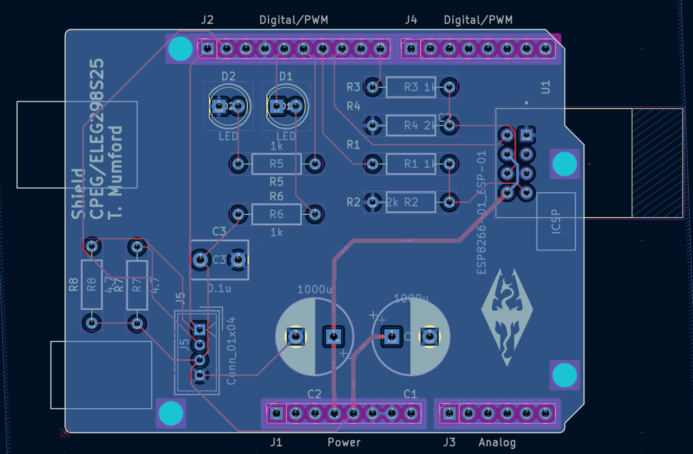
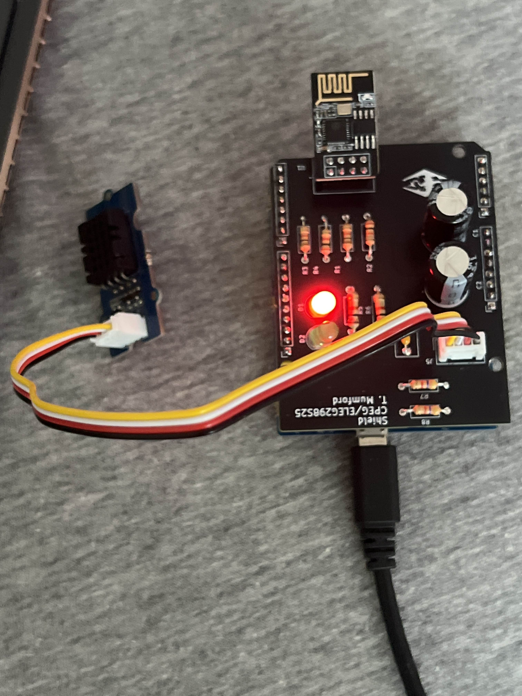
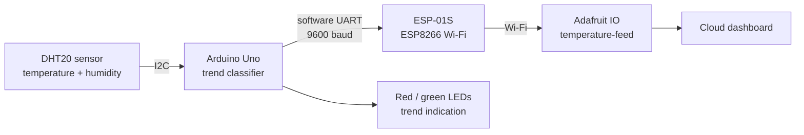

# IoT Sensor Node — Custom Arduino Shield PCB

A two-layer PCB designed from scratch in KiCad, fabricated at JLCPCB, hand-assembled, and running firmware that publishes live temperature telemetry to a cloud dashboard over Wi-Fi.

## Overview

University of Delaware coursework: **ELEG 298, ECE Design Challenges (Spring 2025)**. My first board taken end to end — schematic capture through layout, design rule check, Gerber generation, fabrication order, assembly, and bring-up.

The board is an Arduino Uno shield carrying a DHT20 temperature/humidity sensor interface, an ESP-01S Wi-Fi module on a UART link, status LEDs, and the supporting passives. Firmware reads temperature, classifies the trend as rising, falling or stable, signals that trend on two LEDs, and publishes each reading to an Adafruit IO feed over Wi-Fi.

<p align="center">
  
  
</p>

<p align="center"><em>Left: the two-layer layout in KiCad. Right: the fabricated board hand-assembled, with the ESP-01S module fitted and a Grove sensor attached.</em></p>

## Hardware

| Function | Part |
|---|---|
| Host | Arduino Uno (shield form factor) |
| Wi-Fi | ESP-01S (ESP8266) over software UART |
| Sensor | DHT20 temperature / humidity (I²C, Grove connector) |
| Indicators | 2 × LED with 1 kΩ current-limiting resistors |
| Power | Bulk 1000 µF electrolytics + 0.1 µF decoupling |
| Level/pull-ups | 1 kΩ / 2 kΩ divider network, 4.7 kΩ I²C pull-ups |

Two copper layers (`F_Cu`, `B_Cu`), silkscreen on both sides, mounting holes, and an ICSP header passthrough.

## Software / Tools

- **KiCad** — schematic capture, PCB layout, DRC, Gerber and drill file export
- **Arduino C++** — `SoftwareSerial`, Grove DHT library
- **JLCPCB** — fabrication
- **Adafruit IO** — cloud feed and dashboard
- DigiKey-sourced BOM with costed line items

## Architecture



The Uno drives the ESP-01S through a simple text command protocol over software serial (`wifi_ssid=`, `wifi_pass=`, `io_user=`, `io_key=`, `setup_io`, `setup_pubfeed=`, `send_data=`), with per-command timeouts and a hardware reset line to bring the module up cleanly at boot.

## Key Engineering Work

**Full PCB workflow, not just a schematic.** Component placement, two-layer routing with 45° trace angles and no right-angle bends, an 8 mil minimum line/space rule, silkscreen reference designators and polarity markers on both sides, DRC to zero errors and zero airwires, then Gerber + drill export and a fabrication-portal preview check before ordering. The Gerber set that was actually sent to the fab is in `hardware/gerbers/`.

**Designing for hand assembly.** The board mixes through-hole and SMD parts, with part choice and spacing driven by what could realistically be soldered by hand and reworked if wrong — a constraint that shaped the layout as much as the electrical requirements did.

**Trend classification instead of raw reporting.** Firmware compares each reading against the previous one with a ±0.1 °C tolerance band and tracks the last rising value, so the LEDs show direction of change rather than flickering on sensor noise, plus a stable-band indication between 22–24 °C.

**Reset sequencing.** The ESP-01S is held in reset at boot and released deliberately before any command is sent, which avoids the race where configuration commands are transmitted before the module's UART is listening.

## Testing / Validation

- **DRC and airwire check** in KiCad before Gerber export; fabrication-portal preview reviewed against the intended layout.
- **Continuity and power-rail checks** on the bare board before any active parts were fitted.
- **Incremental bring-up** — power, then LEDs, then sensor over I²C, then the ESP-01S link, then cloud publishing.
- **End-to-end verification** by watching readings appear on the Adafruit IO dashboard while warming the sensor by hand and confirming the LED trend indication matched.

## Repository Structure

```
firmware/           iot_sensor_node.ino - Arduino firmware
hardware/
  kicad/            schematic and two-layer board layout
  gerbers/          fabrication set sent to JLCPCB (copper, mask, silk, paste, drill)
docs/               final project design report
media/              layout render and photo of the assembled board
```

## Security Note

The Adafruit IO key and Wi-Fi credentials are **redacted** from the committed firmware (`IO_KEY = "REPLACE_WITH_ADAFRUIT_IO_KEY"`). Supply your own credentials to run it. No live key appears anywhere in this repository or its commit history.

## What I Learned

The layout was where the real learning was. A schematic that passes electrical rules can still be a board that is painful to assemble, hard to probe, and awkward to mount — trace angles, part spacing, silkscreen legibility and test-point access are decisions you only appreciate once you are holding the fabricated board with an iron in your hand.

Ordering it was the other half. Once Gerbers are submitted there is no undo, which forces a much more careful review pass than any purely simulated assignment ever did.

## Academic Context

University of Delaware, ELEG 298 — ECE Design Challenges, Spring 2025. Design, layout, firmware and assembly are my own work.
